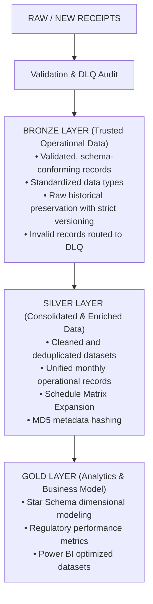

# Public Transit Regulatory Data Lakehouse (`data-lakehouse-seinfra`)

A demo repository showcasing an end-to-end Data Lakehouse solution designed for the public transportation regulatory domain (inspired by real-world public transportation regulatory operations).

This platform automates the ingestion, auditing, consolidation, and business modeling of monthly operational trip logs and system registration metadata. It bridges declared operational data with cadastral records to support **tariff calculation, fleet utilization monitoring, and schedule compliance reporting**.

---

## Business Context & Motivation

Public transit regulation requires continuous monitoring of operational data submitted by concessionaire bus companies, cross-referencing their declared performance against official state registrations.

### Data Streams

- **Realized Trips Data**
  - Operational logs submitted via SEI System

- **SGTI System Data**
  - Master Registration (Routes, Schedules, Vehicles, Contracts)

- **BMI Reports**
  - Monthly Informative Bulletins (Boletim Mensal Informativo)

## Medallion Architecture

The project enforces strict separation of concerns across a three-tier Medallion Architecture, guaranteeing data quality, traceability, and high-performance querying for Power BI consumption.



## Key Features

- **Data Quality & Validation Framework:** Syntactic and business validation (Regex pattern matching for vehicle license plates and service identifiers, date range verification, and strict domain enforcement).

- **Automated Rectification Lifecycle:** Automatically detects re-submitted data for previously ingested operating periods, storing raw copies in dedicated *retificadas* archives and flagging row lineage (`is_rectification=True`).

- **Schedule Matrix Expansion Engine:** Converts static schedule matrices (operating days, month flags, holiday rules) into granular, date-specific trip instances for the entire target operational year.

- **Incremental Processing via MD5 Hashing:** Implements file signature caching to prevent redundant consolidation and re-processing of unchanged SGTI datasets.

- **Dead-Letter Queue (DLQ) & Lineage Audit:** Routes invalid records to `audit_discarded_data.xlsx` with detailed rejection codes, enabling manual resolution without data loss.

## Repository Structure

```text
data-lakehouse-seinfra/
├── data/
│   ├── ingestion/
│   │   ├── operational/2026/
│   │   │   ├── new-receipts/
│   │   │   │   └── Landing directory for operational receipts
│   │   │   └── raw/
│   │   │       └── Immutable raw archive (partitioned by company)
│   │   └── sgti/2026/
│   │       └── Landing directory for SGTI files
│   │
│   ├── bronze/
│   │   ├── operational/2026/
│   │   │   └── Validated operational data & DLQ audit ledger
│   │   └── sgti/2026/
│   │       └── Archived SGTI source files
│   │
│   └── silver/
│       └── sgti/2026/
│           └── Consolidated Parquet datasets & log ledgers
│
├── src/
│   └── steps/
│       ├── op_bronze_layer.py
│       │   └── Ingestion, validation & DLQ routing
│       ├── sgti_silver_layer.py
│       │   └── Consolidation, schedule expansion & caching
│       └── op_audit_reincorporation.py
│           └── Re-ingestion workflow for resolved DLQ items
│
├── requirements.txt
└── README.md```


## Pipeline Execution Steps

### 1. Operational Ingestion & Bronze Layer (`op_bronze_layer.py`)

Processes raw operational spreadsheets, validates columns (`service_id`, `date`, `schedule_time`, `path`, `type`, `vehicle`), partitions raw data by company, and segregates malformed rows into the audit queue.

### 2. SGTI Consolidation & Silver Layer (`sgti_silver_layer.py`)

Consolidates system metadata across schedule, service, and vehicle categories into Parquet files. Executes the calendar expansion engine on schedule matrices to project daily operating trips for calendar year 2026.

### 3. Audit Reincorporation Pipeline (`op_audit_reincorporation.py`)

Reads manually corrected records flagged with `CORRIGIDO_POR_HUMANO = "SIM"` in the audit ledger, updates the primary Bronze Parquet dataset, and appends tracking copies to RAW.

## Future Roadmap

- [ ] Operational Trips Silver Layer Processing (`op_silver_layer.py`)
  - Consolidating validated operational receipts from Bronze into unified Parquet storage.
  - Performing deduplication and timestamp normalization across all operators.

- [ ] BMI Report Pipeline
  - Ingesting and standardizing Monthly Informative Bulletins (BMI).
  - Tracking financial and operational indicators such as fuel, mileage, and passenger volume.

- [ ] Gold Layer Dimensional Modeling
  - Creating Star Schema models.
  - Delivering Power BI reporting assets.

- [ ] Centralized Fleet Dataset
  - Building an internal fleet reference dataset based on SGTI metadata.
  - Supporting regulatory monitoring and tariff calculations.

- [ ] Automated Ingestion Platform
  - Migrating manual file landing processes to direct web/API ingestion.

- [ ] Automated Non-Compliance Feedback Loop
  - Generating automated notifications for rejected operational submissions.