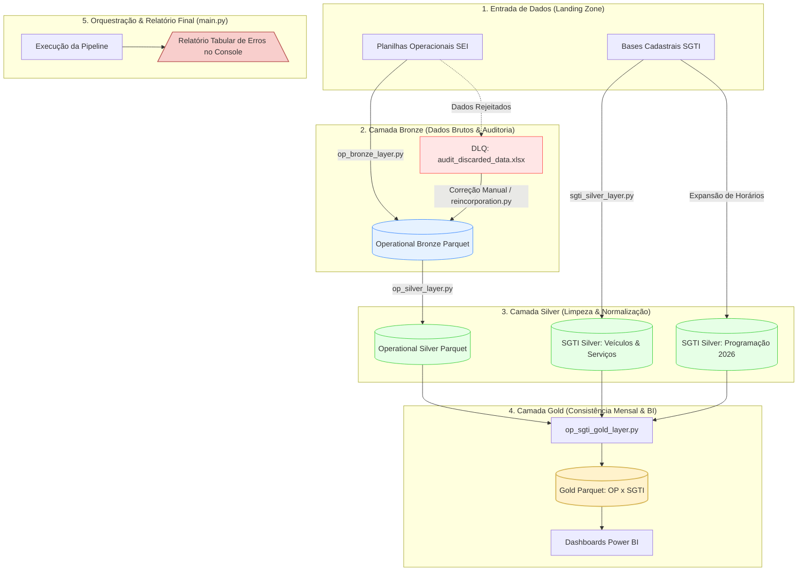

<div align="right">
  <a href="#english">🇺🇸 English</a> | <a href="#portugues">🇧🇷 Português</a>
</div>

<div id="english"></div>

# Public Transit Regulatory Data Lakehouse

An end-to-end Data Lakehouse solution designed for public transport regulation, processing monthly operational data, log records, and registry data to support fare calculation, fleet monitoring, and schedule adherence.

> 🚀 **Production Status:** This repository contains the architecture and codebase applied in production for public transport regulation under the State Government of Minas Gerais (SEINFRA-MG).

---

## 📐 Data Flow Architecture



---

## 🏗️ Architecture & Key Features

The project enforces strict separation of concerns using a **Medallion Architecture** (Bronze, Silver, Gold), ensuring data quality, full lineage, and optimized querying for Power BI.

* **Pre-Validation & Data Quality:** Pre-checks input file structure (sheet count, column limits) before pipeline initiation. Applies strict Regex validation for vehicle plates, dates, paths, and service IDs, routing invalid records to a Dead-Letter Queue (audit_discarded_data.xlsx). (`audit_discarded_data.xlsx`).
* **Automated Rectification & Ingestion Control:** Detects re-submitted operational data (`is_rectification=True`), prevents execution of files with >= 75% error rates, archives raw copies safely, and sets lineage flags.
* **Metadata & Company Alignment:** Maps raw file keys to official company registry codes via (`dim_delegatarias.xlsx`)
* **Schedule Matrix Expansion Engine:** Converts static schedule matrices into granular, date-specific trip instances across the operational calendar.
* **Audit Reincorporation Workflow:** Seamlessly reincorporates manually corrected records into the data cycle until the Gold Layer is updated.
* **Operational Silver Normalization & Enrichment:** Cleans and enriches operational data through company mapping, vehicle validation, and structural parameter integration.
* **Gold Layer Consolidation:** Merges operational runs with official SGTI vehicle and schedule registries to generate consistency reports for regulatory auditing.

---

## 📂 Project Structure

```text
data-lakehouse-seinfra/
├── main.py                            # Pipeline orchestrator
├── data/                              # Storage partitioned by Medallion layers
│   ├── metadata/                      # Dimensional mapping templates (dim_delegatarias)
│   ├── ingestion/                     # Landing zone for operational, SGTI & BMI inputs
│   ├── bronze/                        # Bronze layer storage + DLQ audit logs
│   ├── silver/                        # Standardized Silver datasets
│   └── gold/                          # Aggregated Gold consistency tables
├── src/steps/
│   ├── op_bronze_layer.py             # Operational ingestion, validation & DLQ routing
│   ├── audited_reincorporation.py     # Re-ingestion workflow for resolved DLQ items
│   ├── sgti_silver_layer.py           # SGTI registry consolidation & schedule expansion
│   ├── op_silver_layer.py             # Operational data cleaning, enrichment & cache
│   └── op_sgti_gold_layer.py          # Monthly consistency modeling (OP x SGTI)
├── requirements.txt
└── README.md
```

---

## 🚀 Execution Workflow

* **1. Pre-Validation & Ingestion (`main.py & op_bronze_layer.py`)**: Validates raw operational spreadsheets, routes malformed rows to DLQ (`audit_discarded_data.xlsx`), and saves clean data to the Bronze Layer.
* **2. Audit Reincorporation (`audited_reincorporation.py`)**: Reintroduces resolved DLQ records into the data cycle, updating the final data to be consumed from the Gold layer.
* **3. SGTI Silver Consolidation (`sgti_silver_layer.py`)**: Consolidates registry metadata using MD5 hashing and expands schedule matrices into projected daily trip instances.
* **4. Operational Silver Standardisation & Enrichment (`op_silver_layer.py`)**: Cleans, standardizes, and enriches operational records—mapping company identifiers via (`dim_delegatarias.xlsx`), validating vehicle statuses, and attaching structural parameters like (`total_line_km`).

* **5. Gold Layer Consistency Audit (`op_sgti_gold_layer.py`)**: Cross-references operational execution against official SGTI data (such as scheduled routes, timetables, and baseline parameters) to produce regulatory performance metrics for Power BI.

---

## 📌 Roadmap

- [x] Bronze Layer Ingestion & DLQ Handling

- [x] Audit Reincorporation Workflow

- [x] Silver Layer Normalization & Enrichment (SGTI & Operational)

- [x] Gold Layer Cross-Consistency Modeling (OP x SGTI)

- [ ] BMI Report Pipeline: Full ingestion and metric tracking for Monthly Informative Bulletins.

- [ ] Automated Non-Compliance Notifications: Automated alerts for companies submitting corrupted or high-error operational batches.

<div id="portugues"></div>

# Data Lakehouse para Regulação do Transporte Público

Uma solução Data Lakehouse end-to-end desenvolvida para a regulação do transporte público, processando dados operacionais mensais, registros e dados cadastrais para apoiar o cálculo tarifário, o monitoramento da frota e a verificação do cumprimento da programação.

> 🚀 **Status de Produção:** Este repositório contém a arquitetura e a base de código aplicadas em produção na regulação do transporte público no âmbito do Governo do Estado de Minas Gerais (SEINFRA-MG).

---

## 📐 Arquitetura do Fluxo de Dados


---

## 🏗️ Arquitetura & Principais Funcionalidades

O projeto implementa uma separação rigorosa de responsabilidades utilizando a **Arquitetura Medallion** (Bronze, Silver e Gold), garantindo qualidade dos dados, rastreabilidade completa e consultas otimizadas para consumo no Power BI.

* **Pré-Validação & Qualidade de Dados:** Verifica previamente a estrutura dos arquivos de entrada, incluindo quantidade de abas e limites de colunas, antes da execução da pipeline. Aplica validações rigorosas por Regex para placas de veículos, datas, trajetos e identificadores de serviço, direcionando registros inválidos para uma Dead-Letter Queue (`audit_discarded_data.xlsx`).

* **Retificação Automatizada & Controle de Ingestão:** Detecta dados operacionais reenviados (`is_rectification=True`), impede a execução de arquivos com taxa de erro >= 75%, arquiva cópias dos dados brutos de forma segura e atribui indicadores de linhagem.

* **Metadados & Mapeamento de Empresas:** Mapeia as chaves provenientes dos arquivos brutos para os códigos oficiais do cadastro de empresas por meio do `dim_delegatarias.xlsx`.

* **Motor de Expansão da Matriz de Horários:** Converte matrizes estáticas de programação em instâncias granulares de viagens por data ao longo do calendário operacional.

* **Fluxo de Reincorporação de Auditoria:** Reincorpora registros corrigidos manualmente ao ciclo de dados até a atualização da Camada Gold.

* **Normalização & Enriquecimento Operacional na Silver:** Limpa e enriquece os dados operacionais por meio do mapeamento de empresas, validação de veículos e integração de parâmetros estruturais.

* **Consolidação da Camada Gold:** Integra as viagens operacionais aos cadastros oficiais de veículos e programações do SGTI, gerando dados de consistência destinados à auditoria regulatória.

---

## 📂 Estrutura do Projeto

```text
data-lakehouse-seinfra/
├── main.py                            # Orquestrador da pipeline
├── data/                              # Armazenamento dividido pelas camadas Medallion
│   ├── metadata/                      # Mapeamentos dimensionais (dim_delegatarias)
│   ├── ingestion/                     # Landing Zone para dados Operacionais, SGTI e BMI
│   ├── bronze/                        # Camada Bronze + logs de auditoria/DLQ
│   ├── silver/                        # Conjuntos de dados padronizados da Camada Silver
│   └── gold/                          # Tabelas consolidadas de consistência da Camada Gold
├── src/steps/
│   ├── op_bronze_layer.py             # Ingestão operacional, validação e roteamento para DLQ
│   ├── audited_reincorporation.py     # Reingestão dos registros corrigidos da DLQ
│   ├── sgti_silver_layer.py           # Consolidação cadastral SGTI e expansão da programação
│   ├── op_silver_layer.py             # Limpeza, enriquecimento e cache dos dados operacionais
│   └── op_sgti_gold_layer.py          # Modelagem mensal de consistência (OP x SGTI)
├── requirements.txt
└── README.md
```

---

## 🚀 Fluxo de Execução

* **1. Pré-Validação & Ingestão (`main.py & op_bronze_layer.py`):** Valida as planilhas operacionais brutas, direciona linhas inválidas para a DLQ (`audit_discarded_data.xlsx`) e salva os registros válidos na Camada Bronze.

* **2. Reincorporação de Auditoria (`audited_reincorporation.py`):** Reintroduz no ciclo de dados os registros corrigidos provenientes da DLQ, permitindo sua incorporação aos dados finais consumidos a partir da Camada Gold.

* **3. Consolidação SGTI Silver (`sgti_silver_layer.py`):** Consolida os dados cadastrais utilizando hash MD5 e expande as matrizes de programação em instâncias projetadas de viagens diárias.

* **4. Padronização & Enriquecimento da Operational Silver (`op_silver_layer.py`):** Limpa, padroniza e enriquece os registros operacionais por meio do mapeamento de empresas via `dim_delegatarias.xlsx`, validação da situação dos veículos e integração de parâmetros estruturais, como `total_line_km`.

* **5. Auditoria de Consistência da Camada Gold (`op_sgti_gold_layer.py`):** Cruza a execução operacional com os dados oficiais do SGTI, como linhas programadas, horários e parâmetros de referência, produzindo métricas de desempenho regulatório para consumo no Power BI.

---

## 📌 Roadmap

- [x] Ingestão na Camada Bronze & Tratamento via DLQ

- [x] Fluxo de Reincorporação de Auditoria

- [x] Normalização & Enriquecimento na Camada Silver (SGTI & Operacional)

- [x] Modelagem de Consistência Cruzada na Camada Gold (OP x SGTI)

- [ ] **Pipeline de Relatórios BMI:** Ingestão completa e acompanhamento de métricas referentes aos Boletins Mensais Informativos.

- [ ] **Notificações Automatizadas de Não Conformidade:** Geração automatizada de alertas para empresas que enviarem lotes operacionais corrompidos ou com altas taxas de erro.