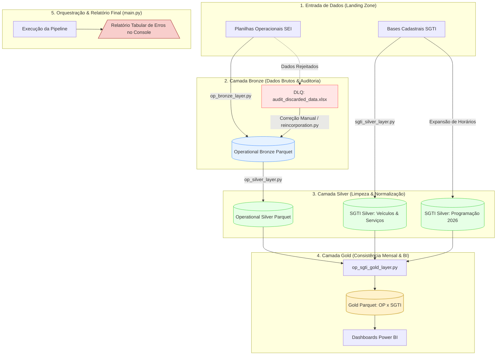

# Public Transit Regulatory Data Lakehouse

An end-to-end Data Lakehouse solution designed for public transport regulation, processing monthly operational data, log records, and registry data to support fare calculation, fleet monitoring, and schedule adherence.

> ℹ️ **Note:** This repository is a simplified, English-translated demo version of the work I carried out in public transport regulation for the State Government of Minas Gerais (SEINFRA-MG), and it is currently under active development.

---

## 📐 Data Flow Architecture



---

## 🏗️ Architecture & Key Features

The project enforces strict separation of concerns using a **Medallion Architecture** (Bronze, Silver, Gold), ensuring data quality, full lineage, and optimized querying for Power BI.

* **Data Quality & DLQ:** Strict Regex validation for vehicle plates and service IDs, routing invalid records to a Dead-Letter Queue (`audit_discarded_data.xlsx`) for human resolution.
* **Automated Rectification Lifecycle:** Detects re-submitted operational data, archives raw copies, and sets lineage flags (`is_rectification=True`).
* **Schedule Matrix Expansion Engine:** Converts static schedule matrices into granular, date-specific trip instances across the operational calendar.
* **Incremental Processing:** Employs MD5 file hashing to prevent redundant consolidation of unchanged datasets.

---

## 📂 Project Structure

```text
data-lakehouse-seinfra/
├── data/              # Storage partitioned by Medallion layers (Bronze / Silver)
├── src/steps/
│   ├── op_bronze_layer.py            # Ingestion, validation & DLQ routing
│   ├── sgti_silver_layer.py          # Consolidation & schedule expansion
│   └── op_audit_reincorporation.py   # Re-ingestion workflow for resolved DLQ items
├── requirements.txt
└── README.md
```

---

## 🚀 Execution Workflow

* **1. Operational Ingestion & Bronze (`op_bronze_layer.py`)**: Validates raw operational spreadsheets, routes malformed rows to DLQ (`audit_discarded_data.xlsx`), and saves clean data as Bronze Parquet.
* **2. SGTI Consolidation & Silver (`sgti_silver_layer.py`)**: Consolidates registry metadata using MD5 hashing and expands schedule matrices into projected daily trip instances.
* **3. Audit Reincorporation (`op_audit_reincorporation.py`)**: Re-ingests manually resolved records (`CORRIGIDO_POR_HUMANO = "SIM"`) back into Bronze storage.

---

## 📌 Roadmap

- [ ] **Silver Operational Processing (`op_silver_layer.py`):** Data standardization, enrichment, and regulatory business validation.
- [ ] **BMI Report Pipeline:** Ingestion and metrics tracking for Monthly Informative Bulletins.
- [ ] **Gold Layer Modeling:** Star Schema design for Power BI reporting assets.
- [ ] **Automated Non-Compliance Loop:** Automated notifications for rejected operational submissions.
